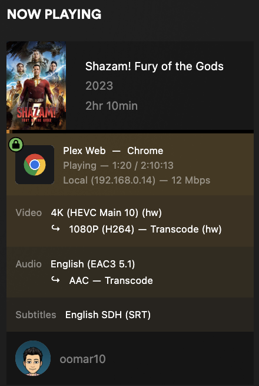
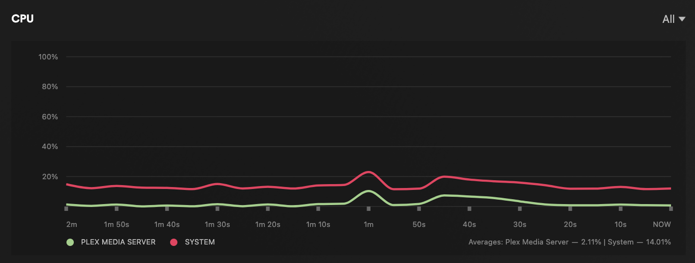
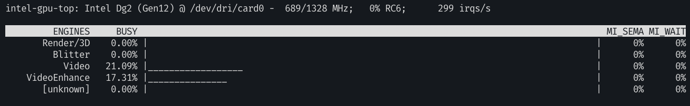

# Adventure ahead
This adventure follows installing and configuring my Intel A770 (DG2) on an Intel i7-3960X Arch Linux system.
Follow THE Arch wiki -> https://wiki.archlinux.org/title/Intel_graphics.

**Desktop specs as follows**:
- Intel i7-3960X (Xeon 12 V-Cores)
- Intel A770 (DG2)
- 16GB DDR3
- RAMPAGE IV FORMULA Motherboard

## Configuration
Configuring GuC to 3, enabling both HuC (`HEVC/H.265 micro (μ) Controller`) and GuC (`Graphics micro (μ) Controller`).
```sh
> cat /etc/modprobe.d/i915.conf
options i915 enable_guc=3
```

## dmesg Verification
```sh
> sudo dmesg | grep i915                                                                                                                                                              elasticsearch@Shards
[sudo] password for admin:
[    2.157606] i915 0000:03:00.0: vgaarb: deactivate vga console
[    2.157615] i915 0000:03:00.0: [drm] Can't resize LMEM BAR - platform support is missing
[    2.157628] i915 0000:03:00.0: [drm] Local memory IO size: 0x0000000010000000
[    2.157630] i915 0000:03:00.0: [drm] Local memory available: 0x00000003fa000000
[    2.157631] i915 0000:03:00.0: [drm] Using a reduced BAR size of 256MiB. Consider enabling 'Resizable BAR' or similar, if available in the BIOS.
[    2.172141] i915 0000:03:00.0: vgaarb: changed VGA decodes: olddecodes=io+mem,decodes=io+mem:owns=io+mem
[    2.175100] i915 0000:03:00.0: [drm] Finished loading DMC firmware i915/dg2_dmc_ver2_08.bin (v2.8)
[    2.189275] i915 0000:03:00.0: [drm] GT0: GuC firmware i915/dg2_guc_70.bin version 70.5.1
[    2.189280] i915 0000:03:00.0: [drm] GT0: HuC firmware i915/dg2_huc_gsc.bin version 7.10.3
[    2.203843] i915 0000:03:00.0: [drm] GT0: GUC: submission enabled
[    2.203853] i915 0000:03:00.0: [drm] GT0: GUC: SLPC enabled
[    2.204155] i915 0000:03:00.0: [drm] GT0: GUC: RC enabled
[    2.284729] [drm] Initialized i915 1.6.0 20201103 for 0000:03:00.0 on minor 0
[    2.286270] i915 0000:03:00.0: [drm] Cannot find any crtc or sizes
[    2.286606] i915 0000:03:00.0: [drm] Cannot find any crtc or sizes
[   12.203149] i915 0000:03:00.0: [drm] GT0: HuC: timed out waiting for MEI GSC
[   20.819752] mei_gsc i915.mei-gscfi.768: FW not ready: resetting: dev_state = 2 pxp = 0
[   20.819776] mei_gsc i915.mei-gscfi.768: unexpected reset: dev_state = ENABLED fw status = 00000345 84670000 00000000 00000000 E0020002 00000000
[   20.820558] mei_gsc i915.mei-gsc.768: FW not ready: resetting: dev_state = 2 pxp = 2
[   20.820613] mei_gsc i915.mei-gsc.768: unexpected reset: dev_state = ENABLED fw status = 00000345 84670000 00000000 00000000 E0020002 00000000
[   21.262169] i915 0000:03:00.0: [drm] GT0: HuC: authenticated!
[   21.262173] mei_pxp i915.mei-gsc.768-fbf6fcf1-96cf-4e2e-a6a6-1bab8cbe36b1: bound 0000:03:00.0 (ops i915_pxp_tee_component_ops [i915])
[   22.246737] snd_hda_intel 0000:04:00.0: bound 0000:03:00.0 (ops i915_audio_component_bind_ops [i915])
```
Not concerned with reBAR, since my MB AND CPU doesn't support reBAR, which isn't really a big deal for my use case.
Looks like the controllers successfully loaded and got enabled.

## Detailed GuC Verification
```sh
> sudo cat /sys/kernel/debug/dri/0/gt0/uc/guc_info                                                                                                                                                                                                                                                                       elasticsearch@Shards
GuC firmware: i915/dg2_guc_70.bin
        status: RUNNING
        version: found 70.5.1
        uCode: 369088 bytes
        RSA: 384 bytes
GuC status 0x80030020:
        Bootrom status = 0x10
        uKernel status = 0x0
        MIA Core status = 0x3
Scratch registers:
         0:     0x0
         1:     0xb03d7
         2:     0x24800
         3:     0x4
         4:     0x40
         5:     0x3a0
         6:     0x56a00008
         7:     0x0
         8:     0x0
         9:     0x0
        10:     0x0
        11:     0x0
        12:     0x0
        13:     0x0
        14:     0x0
        15:     0x0

GuC logging stats:
        Relay full count: 0
        DEBUG:  flush count          0, overflow count          0
        CRASH:  flush count          0, overflow count          0
        CAPTURE:        flush count          0, overflow count          0
CT enabled
H2G Space: 1512
Head: 645
Tail: 645
G2H Space: 12284
Head: 128
Tail: 128
GuC Submission API Version: 1.1.0
GuC Number Outstanding Submission G2H: 0
GuC tasklet count: 0
Requests in GuC submit tasklet:

Global scheduling policies:
  DPC promote time   = 500000
  Max num work items = 15
  Flags              = 0
```

## Detailed HuC Verification
```sh
> sudo cat /sys/kernel/debug/dri/0/gt0/uc/huc_info
HuC firmware: i915/dg2_huc_gsc.bin
        status: RUNNING
        version: found 7.10.3
        uCode: 0 bytes
        RSA: 0 bytes
HuC status: 0x00164001
```

## GPU Kernel driver verification
Ok we're using the right driver.

```sh
> lspci -v | grep VGA -A 9
03:00.0 VGA compatible controller: Intel Corporation DG2 [Arc A770] (rev 08) (prog-if 00 [VGA controller])
Subsystem: Intel Corporation DG2 [Arc A770]
Flags: bus master, fast devsel, latency 0, IRQ 65
Memory at fa000000 (64-bit, non-prefetchable) [size=16M]
Memory at c0000000 (64-bit, prefetchable) [size=256M]
Expansion ROM at 000c0000 [disabled] [size=128K]
Capabilities: <access denied>
Kernel driver in use: i915
Kernel modules: i915
```

## Testing Hardware Encoding works (+Troubleshooting)

> TLDR; install `onevpl-intel-gpu intel-media-driver linux-firmware libva-utils vdpauinfo`

### ffmpeg QSV debugging
Lets encode a random video using HW-Accel Intel QuickSync:
```sh
> ffmpeg -hwaccel_output_format qsv -c:v h264_qsv -i 2022-10-03_09-45-35-back.mp4 -c:v libx264 -c:a copy out.mp4
...
[AVHWDeviceContext @ 0x56506fd61c80] Error initializing an MFX session: -3.
Device creation failed: -1313558101.
No device available for decoder: device type qsv needed for codec h264_qsv.
Stream mapping:
  Stream #0:0 -> #0:0 (h264 (h264_qsv) -> h264 (libx264))
Device setup failed for decoder on input stream #0:0 : Unknown error occurred
```

Hmm, what am I missing?
We're also missing FFMPEG AV1 encoding support using VA-API:
```sh
# We expect to see 'av1_vaapi'.
> ffmpeg -hide_banner -encoders | grep av1
 V....D libaom-av1           libaom AV1 (codec av1)
 V....D librav1e             librav1e AV1 (codec av1)
 V..... libsvtav1            SVT-AV1(Scalable Video Technology for AV1) encoder (codec av1)
 V....D av1_nvenc            NVIDIA NVENC av1 encoder (codec av1)
 V....D av1_amf              AMD AMF AV1 encoder (codec av1)
 A....D wmav1                Windows Media Audio 1

# Let's compile & install one with that supported.
> yay -S ffmpeg-intel-full-git
```

Ok lets also verify all [Video Acceleration API][VAPI] (for DRI) packages are installed:
> (VA-API) is a specification and open source library to provide both hardware accelerated video encoding and decoding, developed by Intel.
```sh
# NOTE: don't need libva-intel-driver (old driver)
> sudo pacman -S intel-media-driver linux-firmware libva-intel-driver libva-utils vdpauinfo
```

```sh
> vainfo --display drm --device /dev/dri/renderD128
Trying display: drm
vainfo: VA-API version: 1.19 (libva 2.18.2)
vainfo: Driver version: Intel iHD driver for Intel(R) Gen Graphics - 23.2.3 ()
vainfo: Supported profile and entrypoints
      VAProfileNone                   : VAEntrypointVideoProc
      VAProfileNone                   : VAEntrypointStats
      VAProfileMPEG2Simple            : VAEntrypointVLD
      VAProfileMPEG2Main              : VAEntrypointVLD
      VAProfileH264Main               : VAEntrypointVLD
      VAProfileH264Main               : VAEntrypointEncSliceLP
      VAProfileH264High               : VAEntrypointVLD
      VAProfileH264High               : VAEntrypointEncSliceLP
      VAProfileJPEGBaseline           : VAEntrypointVLD
      VAProfileJPEGBaseline           : VAEntrypointEncPicture
      VAProfileH264ConstrainedBaseline: VAEntrypointVLD
      VAProfileH264ConstrainedBaseline: VAEntrypointEncSliceLP
      VAProfileHEVCMain               : VAEntrypointVLD
      VAProfileHEVCMain               : VAEntrypointEncSliceLP
      VAProfileHEVCMain10             : VAEntrypointVLD
      VAProfileHEVCMain10             : VAEntrypointEncSliceLP
      VAProfileVP9Profile0            : VAEntrypointVLD
      VAProfileVP9Profile0            : VAEntrypointEncSliceLP
      VAProfileVP9Profile1            : VAEntrypointVLD
      VAProfileVP9Profile1            : VAEntrypointEncSliceLP
      VAProfileVP9Profile2            : VAEntrypointVLD
      VAProfileVP9Profile2            : VAEntrypointEncSliceLP
      VAProfileVP9Profile3            : VAEntrypointVLD
      VAProfileVP9Profile3            : VAEntrypointEncSliceLP
      VAProfileHEVCMain12             : VAEntrypointVLD
      VAProfileHEVCMain422_10         : VAEntrypointVLD
      VAProfileHEVCMain422_12         : VAEntrypointVLD
      VAProfileHEVCMain444            : VAEntrypointVLD
      VAProfileHEVCMain444            : VAEntrypointEncSliceLP
      VAProfileHEVCMain444_10         : VAEntrypointVLD
      VAProfileHEVCMain444_10         : VAEntrypointEncSliceLP
      VAProfileHEVCMain444_12         : VAEntrypointVLD
      VAProfileHEVCSccMain            : VAEntrypointVLD
      VAProfileHEVCSccMain            : VAEntrypointEncSliceLP
      VAProfileHEVCSccMain10          : VAEntrypointVLD
      VAProfileHEVCSccMain10          : VAEntrypointEncSliceLP
      VAProfileHEVCSccMain444         : VAEntrypointVLD
      VAProfileHEVCSccMain444         : VAEntrypointEncSliceLP
      VAProfileAV1Profile0            : VAEntrypointVLD
      VAProfileAV1Profile0            : VAEntrypointEncSliceLP
      VAProfileHEVCSccMain444_10      : VAEntrypointVLD
      VAProfileHEVCSccMain444_10      : VAEntrypointEncSliceLP
```

Hmm, wait... shouldn't we be using the i915 driver!?

Well this is interesting:
```md
You can override the driver for VA-API by using the `LIBVA_DRIVER_NAME` environment variable:

Intel graphics:
- For libva-intel-driver use i965.
- For intel-media-driver use iHD.
```

Drivers can be found under `/usr/lib/dri/${LIBVA_DRIVER_NAME}_drv_video.s`:
```sh
> l /usr/lib/dri/
.rwxr-xr-x  32M root root 10 Jul 10:39 crocus_dri.so
.rwxr-xr-x  32M root root 10 Jul 10:39 d3d12_dri.so
.rwxr-xr-x  32M root root 10 Jul 10:39 i915_dri.so
.rwxr-xr-x 8.2M root root  6 Mar  2022 i965_drv_video.so
.rwxr-xr-x  36M root root 23 Jun 18:43 iHD_drv_video.so
.rwxr-xr-x  32M root root 10 Jul 10:39 iris_dri.so
.rwxr-xr-x  32M root root 10 Jul 10:39 kms_swrast_dri.so
.rwxr-xr-x  32M root root 10 Jul 10:39 nouveau_dri.so
.rwxr-xr-x  32M root root 10 Jul 10:39 r300_dri.so
.rwxr-xr-x  32M root root 10 Jul 10:39 r600_dri.so
.rwxr-xr-x  32M root root 10 Jul 10:39 radeonsi_dri.so
.rwxr-xr-x  32M root root 10 Jul 10:39 swrast_dri.so
.rwxr-xr-x  32M root root 10 Jul 10:39 virtio_gpu_dri.so
.rwxr-xr-x  32M root root 10 Jul 10:39 vmwgfx_dri.so
.rwxr-xr-x  32M root root 10 Jul 10:39 zink_dri.so
```

wtf, does iHD include i915? -yes

Ok lets circle back to the FFMPEG error (`Error initializing a MFX session: unsupported (-3)`). On the following post, it seems this user just needed the Linux Headers. Lets try that.
- https://superuser.com/questions/1760740/ffmpeg-cant-create-mfx-session-to-use-intel-arc-gpu

```sh
# I already have my linux headers installed though :/.
> pacman -Q | grep header
linux-api-headers 6.3-1
linux-headers 6.4.3.arch1-2
vulkan-headers 1:1.3.257-1
```

Build that latest ffmpeg with Intel Arc support:
```sh
> yay -S ffmpeg-intel-full-git
> ffmpeg -hide_banner -encoders | grep -i av1
 V....D libaom-av1           libaom AV1 (codec av1)
 V....D librav1e             librav1e AV1 (codec av1)
 V..... libsvtav1            SVT-AV1(Scalable Video Technology for AV1) encoder (codec av1)
 A....D wmav1                Windows Media Audio 1
> ffmpeg -hide_banner -encoders | grep -i intel
 V..... h264_qsv             H.264 / AVC / MPEG-4 AVC / MPEG-4 part 10 (Intel Quick Sync Video acceleration) (codec h264)
 V..... hevc_qsv             HEVC (Intel Quick Sync Video acceleration) (codec hevc)
 V..... mjpeg_qsv            MJPEG (Intel Quick Sync Video acceleration) (codec mjpeg)
 V..... mpeg2_qsv            MPEG-2 video (Intel Quick Sync Video acceleration) (codec mpeg2video)
 V..... vp9_qsv              VP9 video (Intel Quick Sync Video acceleration) (codec vp9)
```

Well we don't see Intel AV1 encoding (*av1_vaapi*). Let's try H264 with HW acceleration first.
Nope same thing :(
```sh
> sudo ffmpeg -i 2022-10-03_09-45-35-back.mp4 -c:v h264_qsv -b:v 5M out.mp4
...
[swscaler @ 0x562100c52c40] deprecated pixel format used, make sure you did set range correctly
    Last message repeated 3 times
[h264_qsv @ 0x5620ffff3a00] Error initializing a MFX session: unsupported (-3)
[vost#0:0/h264_qsv @ 0x5620ffff2bc0] Error while opening encoder - maybe incorrect parameters such as bit_rate, rate, width or height.

# Ok another with verbose logs.
> sudo ffmpeg -loglevel verbose -hwaccel qsv -c:v h264_qsv -qsv_device /dev/dri/renderD128 -i 2022-10-03_09-45-35-back.mp4 -vf hwdownload,format=nv12 -pix_fmt yuv420p out.mp4
...
[AVHWDeviceContext @ 0x559e26ec0dc0] libva: VA-API version 1.19.0
[AVHWDeviceContext @ 0x559e26ec0dc0] libva: User requested driver 'iHD'
[AVHWDeviceContext @ 0x559e26ec0dc0] libva: Trying to open /usr/lib/dri/iHD_drv_video.so
[AVHWDeviceContext @ 0x559e26ec0dc0] libva: Found init function __vaDriverInit_1_18
[AVHWDeviceContext @ 0x559e26ec0dc0] libva: va_openDriver() returns 0
[AVHWDeviceContext @ 0x559e26ec0dc0] Initialised VAAPI connection: version 1.19
[AVHWDeviceContext @ 0x559e26ec0dc0] VAAPI driver: Intel iHD driver for Intel(R) Gen Graphics - 23.2.3 ().
[AVHWDeviceContext @ 0x559e26ec0dc0] Driver not found in known nonstandard list, using standard behaviour.
[AVHWDeviceContext @ 0x559e26ec08c0] Use Intel(R) Media SDK to create MFX session, API version is 1.35, the required implementation version is 1.3
[AVHWDeviceContext @ 0x559e26ec08c0] Error initializing an MFX session: -3.
Device creation failed: -1313558101.
Failed to set value '/dev/dri/renderD128' for option 'qsv_device': Unknown error occurred
Error parsing global options: Unknown error occurred
```

### Finally QSV ffmpeg works
Oh WOW, intalled `onevpl-intel-gpu` and that worked...
```sh
> sudo pacman -S onevpl-intel-gpu
> sudo ffmpeg -loglevel verbose -hwaccel qsv -c:v h264_qsv -i 2022-10-03_09-45-35-back.mp4 -vf hwdownload,format=nv12 -pix_fmt yuv420p out.mp4
...
[vost#0:0/libx264 @ 0x5625a0eaca40] Past duration 0.812492 too large
frame= 2001 fps= 67 q=30.0 size=   35072kB time=00:00:55.59 bitrate=5167.5kbits/s frame= 2053 fps= 68 q=30.0 size=   35328kB time=00:00:57.01 bitrate=5075.7kbits/s [in#0/mov,mp4,m4a,3gp,3g2,mj2 @ 0x5625a0e8a600] EOF while reading input
[in#0/mov,mp4,m4a,3gp,3g2,mj2 @ 0x5625a0e8a600] Terminating demuxer thread
[vist#0:0/h264 @ 0x5625a0fb1880] Decoder thread received EOF packet
[h264_qsv @ 0x5625a0ec02c0] A decode call did not consume any data: expect more data at input (-10)
    Last message repeated 2 times
[vist#0:0/h264 @ 0x5625a0fb1880] Decoder returned EOF, finishing
[vist#0:0/h264 @ 0x5625a0fb1880] Terminating decoder thread
No more output streams to write to, finishing.
[out#0/mp4 @ 0x5625a0f665c0] All streams finished
[out#0/mp4 @ 0x5625a0f665c0] Terminating muxer thread
[AVIOContext @ 0x5625a10beec0] Statistics: 36708016 bytes written, 2 seeks, 143 writeouts
[out#0/mp4 @ 0x5625a0f665c0] Output file #0 (out.mp4):
[out#0/mp4 @ 0x5625a0f665c0]   Output stream #0:0 (video): 2129 frames encoded; 2129 packets muxed (36683749 bytes);
[out#0/mp4 @ 0x5625a0f665c0]   Total: 2129 packets (36683749 bytes) muxed
...
```

Ok let's try HEVC:
```sh
> ffmpeg -i 2022-10-03_09-45-35-back.mp4 -c:v hevc_qsv -b:v 5M out.mp4
...
      cpb: bitrate max/min/avg: 0/0/5000000 buffer size: 0 vbv_delay: N/A
[out#0/mp4 @ 0x56451aeff3c0] video:35550kB audio:0kB subtitle:0kB other streams:0kB global headers:0kB muxing overhead: 0.080095%
frame= 2129 fps=502 q=-0.0 Lsize=   35578kB time=00:00:59.10 bitrate=4931.3kbits/s dup=2 drop=1 speed=13.9x
```

VP9 encoding also works using HW Accel. Nice:
```sh
> ffmpeg -i 2022-10-03_09-45-35-back.mp4 -c:v vp9_qsv -b:v 5M out.mp4

# Intel top snapshot
       Render/3D    0.00% |       |      0%      0%
         Blitter    0.00% |       |      0%      0%
           Video   49.89% |____   |      0%      0%
    VideoEnhance    8.25% |____   |      0%      0%
       [unknown]    0.00% |       |      0%      0%
```

## Updating Dockerized Plex Server
All we need to do is passthrough the DRI device into the container and that *should* be sufficient for the
plex process to pick up and use the A770 for encoding.

Patched docker compose field:
```yaml
...
    # Intel GPU Device mount
    devices:
    - "/dev/dri:/dev/dri"
...
```

Let's confirm the device was mounted into the container:
```sh
> docker exec plex ls -lh /dev/dri
total 0
crw-rw---- 1 root video2 226,   0 Jul 18 16:03 card0
crw-rw-rw- 1 root video1 226, 128 Jul 18 16:03 renderD128
```

Ok lets try and transcode a video:
- We can see Hardware Transcoding is WORKING and CPU util is minimal!





**Resources**:
- [Plex AV1 Playback Support](https://forums.plex.tv/t/plex-htpc-for-mac-windows-and-linux/703783/30)
- https://github.com/linuxserver/docker-plex
- https://aur.archlinux.org/packages/ffmpeg-intel-full-git


[VAPI]: https://en.wikipedia.org/wiki/Video_Acceleration_API

